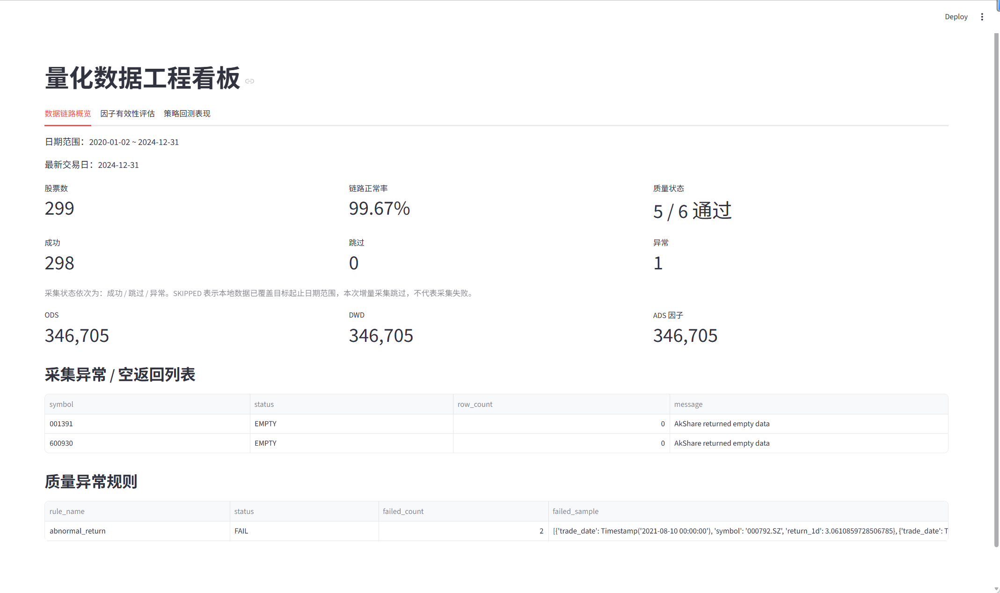
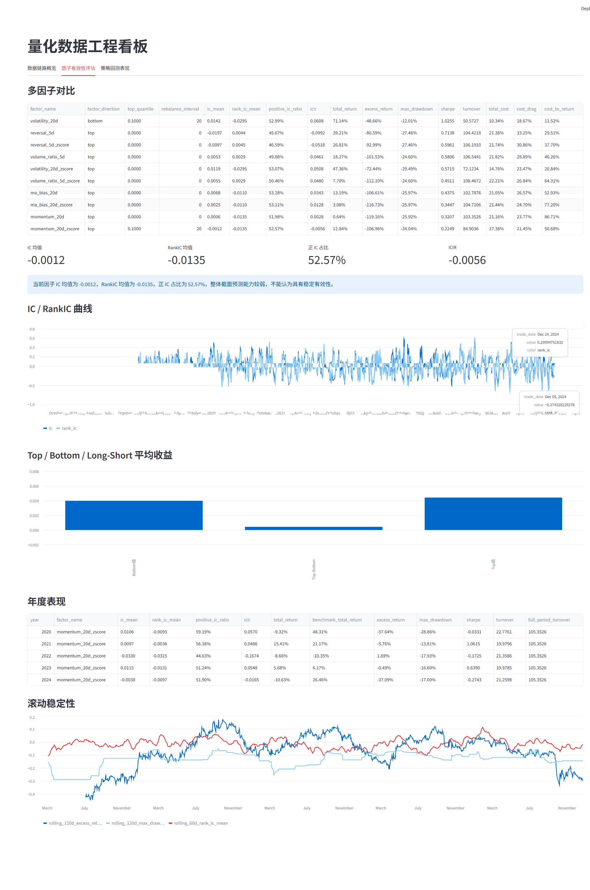
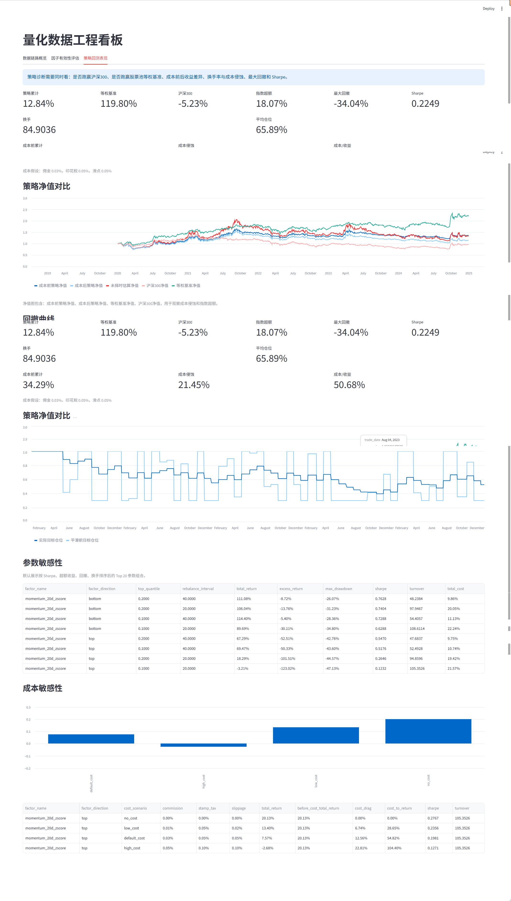

# Quant Data Engineering

## Project Overview

Quant Data Engineering is a local A-share quant data engineering project. It builds a reproducible pipeline from market data ingestion to layered datasets, data quality checks, factor calculation, factor evaluation, backtesting, ClickHouse loading, and Streamlit dashboard visualization.

The project focuses on the engineering process behind quantitative research: data acquisition, cleaning, validation, storage, query interfaces, and result presentation. It is not a black-box trading signal or production trading system.

## Why This Project

Quant research depends on stable and traceable data pipelines. This project uses a compact local stack to answer several practical questions:

- Can raw daily market data be ingested and incrementally updated in a repeatable way?
- Can ODS, DWD, and ADS layers make the data lifecycle easier to inspect?
- Can quality rules catch missing values, invalid prices, duplicate keys, and abnormal returns before factor research?
- Can factor IC, RankIC, grouped returns, and backtest results be generated from the same pipeline outputs?
- Can the final datasets be queried through ClickHouse and reviewed through a lightweight dashboard?

## Architecture

```text
AkShare / fixture data
        |
        v
ODS raw daily bars
        |
        v
DWD cleaned daily bars + dim tables
        |
        v
Data quality reports
        |
        v
ADS factor wide table + market sentiment table
        |
        +--> Factor evaluation: IC / RankIC / grouped returns
        |
        +--> Backtest: net value / benchmark / drawdown / metrics
        |
        +--> ClickHouse analytical tables
        |
        v
Streamlit dashboard
```

## Features

- AkShare daily data ingestion with stock pool files, retry, incremental updates, run logs, and fallback handling.
- Layered Parquet datasets for ODS, DWD, ADS, reports, and dimension tables.
- Data quality checks for primary key uniqueness, required fields, price validity, volume validity, date completeness, and abnormal returns.
- Baseline price-volume factors:
  - `momentum_20d`
  - `reversal_5d`
  - `volatility_20d`
  - `volume_ratio_5d`
  - `ma_bias_20d`
- Market sentiment factors such as market breadth, trading activity, profit effect, and rolling sentiment score.
- Cross-sectional factor preprocessing with 1% / 99% winsorization and daily z-score standardization.
- Multi-factor evaluation with IC, RankIC, positive IC ratio, ICIR, grouped returns, and long-short return.
- Yearly and rolling-window stability reports for factor IC, RankIC, excess return, drawdown, Sharpe, and turnover.
- Factor-direction validation for both high-factor and low-factor portfolios through `factor_direction = top / bottom`.
- Holding-buffer backtest logic with `entry_quantile` and `exit_quantile` to reduce unnecessary turnover.
- Parameter sensitivity analysis across factor direction, holding quantiles, and rebalance intervals to reduce single-parameter overfitting risk.
- Cost sensitivity analysis across no-cost, low-cost, default-cost, and high-cost assumptions.
- Factor backtest with next-trading-day execution, rebalance interval, before-cost / after-cost net values, equal-weight and CSI 300 benchmarks, transaction costs, slippage, stamp tax, suspension handling, limit-up / limit-down constraints, and smooth sentiment-based exposure control.
- ClickHouse loading and query interface for local analytical use.
- Streamlit dashboard with data pipeline overview, factor evaluation, and strategy backtest performance.
- Pytest coverage for core pipeline behavior using small fixture datasets.

## Dashboard Preview

### Data Pipeline Overview



### Factor Evaluation



### Backtest Performance



## Quick Start

Install the package in editable mode:

```powershell
python -m pip install -e ".[dev]"
```

Run tests:

```powershell
python -m pytest -q
```

Run the one-command local pipeline:

```powershell
.\scripts\run_daily_pipeline.ps1 -StartDate 20240101 -EndDate 20241231
```

### CLI Pipeline Flow

The CLI connects independent modules into an executable data pipeline. Each stage reads the previous stage's Parquet output and writes the next layer of results.

The recommended daily entrypoint is the one-command PowerShell script:

```powershell
.\scripts\run_daily_pipeline.ps1 `
  -StartDate 20240101 `
  -EndDate 20241231
```

The script runs the main stages in order:

```text
incremental ingestion
-> DWD cleaning
-> data quality checks
-> factor calculation
-> factor evaluation
-> backtest
-> yearly / rolling stability
-> parameter sensitivity
-> cost sensitivity
-> optional ClickHouse loading
```

To run the pipeline with sentiment-timing backtest parameters:

```powershell
.\scripts\run_daily_pipeline.ps1 `
  -StartDate 20240101 `
  -EndDate 20241231 `
  -SentimentThreshold 0 `
  -WeakSentimentExposure 0.3 `
  -NormalExposure 1.0
```

To run a smoother strategy-diagnostic version with factor direction and holding buffer:

```powershell
.\scripts\run_daily_pipeline.ps1 `
  -StartDate 20200101 `
  -EndDate 20241231 `
  -FactorName momentum_20d_zscore `
  -FactorDirection top `
  -TopQuantile 0.1 `
  -EntryQuantile 0.1 `
  -ExitQuantile 0.3 `
  -RebalanceInterval 20 `
  -SentimentMode smooth `
  -MinExposure 0.3 `
  -MaxExposure 1.0 `
  -BaseExposure 0.6 `
  -SentimentScale 0.2 `
  -SentimentSmoothAlpha 0.2
```

You can also run diagnostic modules separately:

```powershell
python -m quant_data.cli backtest --output-dir data --factor-name volatility_20d --factor-direction bottom
python -m quant_data.cli sensitivity --output-dir data --factor-names momentum_20d,reversal_5d,volatility_20d
python -m quant_data.cli cost-sensitivity --output-dir data --factor-name momentum_20d_zscore
```

ClickHouse loading is enabled when a password is available. You can set it in the current PowerShell session:

```powershell
$env:CLICKHOUSE_PASSWORD = "<your-clickhouse-password>"
```

Or create a local `.env` file in the project root:

```text
CLICKHOUSE_PASSWORD=<your-clickhouse-password>
```

The `.env` file is ignored by Git and should not be committed.

Launch the dashboard:

```powershell
streamlit run src\quant_data\dashboard\app.py
```

For detailed data fields, query examples, and ClickHouse monitoring SQL, see:

- [Chinese data dictionary](docs/data_dictionary.zh-CN.md)
- [ClickHouse query interface guide](docs/query_interface.zh-CN.md)
- [ClickHouse monitoring SQL](docs/clickhouse_monitoring_queries.sql)
- [Chinese README](README.zh-CN.md)

## Output Tables

Local pipeline outputs are written under `data/` by default. The directory is ignored by Git because generated market data can be large and environment-specific.

```text
data/ods/stock_daily.parquet
data/dwd/stock_daily.parquet
data/dim/trade_calendar.parquet
data/dim/stock_basic.parquet
data/dim/hs300_index.parquet
data/reports/ingestion_report.parquet
data/reports/ingestion_runs.parquet
data/reports/data_quality_report.parquet
data/ads/factor_wide_daily.parquet
data/ads/market_sentiment_daily.parquet
data/ads/factor_eval_<factor_name>.parquet
data/ads/backtest_daily_<factor_name>.parquet
data/ads/backtest_metrics_<factor_name>.json
data/ads/factor_yearly_summary.parquet
data/ads/factor_rolling_summary.parquet
data/ads/parameter_sensitivity.parquet
data/ads/cost_sensitivity.parquet
```

When ClickHouse loading is enabled, the main analytical tables are:

```text
dim_trade_calendar
dim_stock_basic
dim_hs300_index
dwd_stock_daily
ads_factor_wide_daily
ads_market_sentiment_daily
ads_factor_eval
ads_backtest_daily
ads_factor_yearly_summary
ads_factor_rolling_summary
ads_parameter_sensitivity
ads_cost_sensitivity
ops_ingestion_report
ops_ingestion_runs
ops_data_quality_report
```

## Tests

The test suite uses small fixture data and does not require live network data.

```powershell
.\.venv\Scripts\python.exe -m pytest -q
```

Use live AkShare data only when running ingestion or the daily pipeline in a local environment with network access.

## Limitations

- The backtest is research-oriented and simplified. It is intended to validate factor and data-pipeline behavior, not to represent live trading performance.
- Live market data depends on AkShare and upstream data-source availability.
- The current stock pool can be rebuilt from the latest CSI 300 constituents. Historical constituent changes are not fully reconstructed, so long-period backtests may still contain survivorship-bias risk.
- Generated datasets under `data/` are not committed to Git. A new user needs to run the pipeline locally before using the dashboard.
- Transaction cost, suspension, and limit-up / limit-down handling are simplified engineering assumptions and should be reviewed before any production use.
- The dashboard reads local Parquet and JSON outputs. It is designed for local inspection rather than multi-user deployment.
